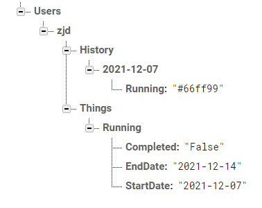

# ThingsHub
Final Project for CS5520

## Backend

DB URL: [ThingsHub – Firebase console (google.com)](https://console.firebase.google.com/project/thingshub-numda21fall/database/thingshub-numda21fall-default-rtdb/data)

### Data Model



> Database User Graph

Users

* User1(UserName, unique)
  * History
    * Date(unique)
      * First Thing Name : Color of Thing
      * Second Thing Name : Color of Thing
      * ...
    * Date (must not be empty)
      * ... 
  * Things
    * Thing Name ( unique ) : 
      * StartDate: Date
      * EndDate: Date
      * Completed: Boolean
* User2(UserName, unique)

> Class

```java
public class User{
    private String userName;
    private Map<Date, List<Things>> history;
    private List<Things> things; 
}
public class Date{
    private String year;
    private String month;
    private String day;
    public String toKey(){ //==> same as toString()
        return year+"-"+month+"-"+day;
    } 
}
public class Things{
    
}
```


### API

1. `createUser(userName, passWord):boolean`: create an user with password, return true if successfully created.
2. `checkUser(userName):boolean`: check if user is valid, return true if user is valid.
3. `changeUserNickName(userName, newNickName):void`: change user nickname with given parameter.
4. `getThings(userName, isCompleted=False):ArrayList<Things>`: return things of given user, with filter = {is completed}
5. `getThings(userName, isCompleted=False):ArrayList<Things>`: return things of given user, with filter = {is completed, specific date}
6. `getThings(userName, isCompleted, startDate, endDate):ArrayList<Things>`: return things of given user, with filter = {is completed, start date, end date}
7. `getColors(userName, date):Map<Date,String> `: get colors of user on given date, return value is a map of <date, color(string)>. 

