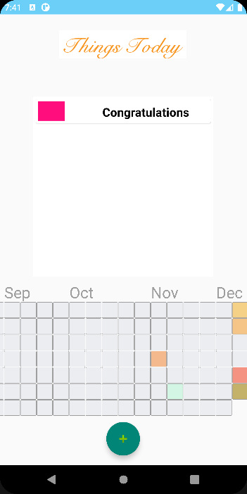

# ThingsHub
Final Project for CS5520


## Functionality

1. Login Page

   User can either login or create via same button to get into our app.

   

2. Account Page

   Users can modify their personal information here, and I visit friends or profile page.

   

   Upload avatar via photo libraries or camera like this:  (**Camera Sensor Usage**)

   

3. Friends Page

   People can visit their friends to see theirs' activities, can add friend via add button.

   

4. Profile Page

   This is the most important page of our app, we can track every details of everyday here:

   

   User can add things via add button:

   

   Where colors can picked via color picker:

   

   App also track location to record things happened, but user can deny this permission request:

   

   A full thing should be like:

   

   

   After adding, the page would be:

   

   We can long press some thing to make it completed:

   

   The colors would also change based on the completion date.

   we can also visit friends' profile page.

## Front End


## Back End

DB URL: [ThingsHub – Firebase console (google.com)](https://console.firebase.google.com/project/thingshub-numda21fall/database/thingshub-numda21fall-default-rtdb/data)

### Data Model


> Database User Graph

Users

* User1(UserName, unique)
  * History
    * Date(unique)
      * First Thing Name : Thing Structure
      * Second Thing Name : Thing Structure
      * ...
    * Date (must not be empty)
      * ... 
  * Things
    * Thing Name ( unique ) : 
      * StartDate: Date
      * EndDate: Date
      * isCompleted: Boolean
      * color: int
      * longitude: double
      * latitude: double
* User2(UserName, unique)

> Class

```java
public class User{
    private String userName;
    private Map<String, List<Things>> history;
    private List<Thing> things; 
    private List<String> friends;
}   
public class Date implements Comparable<Date>{
    private int year;
    private int month;
    private int day;
    public String toKey(){ //==> same as toString()
        return year+"-"+month+"-"+day;
    } 
}
public class Thing {
    private String thingsName;
    private Date startDate;
    private Date endDate;
    private Boolean isCompleted;
    private int color;
    private double longitude;
    private double latitude;
}

```


### API

1. `createUser(userName):boolean`: create an user with password, return true if successfully created, return false if user was already existed.

   Usage: `Server.getInstance().createUser(userName, created->{});`

2. `checkUser(userName, exist):boolean`: check if user is valid, return true if user is valid.

   Usage: `Server.getInstance().checkUser(userName, exist->{});`

3. `addThing(Things):void` add thing to current user;

   Usage: `Server.getInstance().addThing(someThing:Thing);`

4. `getThings(userName):ArrayList<Things>`: return things of given user, return null if current user is not exists.

   Usage: `Server.getInstance().getThings(userName, things->{});`

5. `filterThings(List<Thing> things, isCompleted)`: filter all the things from given `things` that `isCompleted` is given.

   Usage: `filteredThings = Server.getInstance().filterThings(things, true/false);`

6. `filterThings(things, startDate)` filter all the things from given `thigns` that have an end date after given `startDate`.

   Usage: `filteredThings = Server.getInstance().filterThings(things, some date);`

7. `getFriends(userName, callback)`: get friends of given user.

   Usage: `Server.getInstance().getFriends(userName, friends->{});`

8. `addFriend(userName)`: add given user as a friend to current user.

   Usage: `Server.getInstance().addFriend(userName);`

9. `markCompleted(thing:Thing or thingName: String)`: mark some thing as done, automatically added to history

   Usage: `Server.getInstance().markCompleted(thing, true/false);`

10. `getHistory(userName, callback)`: get history of given user as a Map<Date, List<Thing>>;

    Usage: `Server.getInstance().getHistory(userName, history->{});`

11. `mixColor(things)`: mix all the colors of given `things` to one color, temporarily return as an integer. (May add hex-decimal conversion in the future)

12. `getAddress(context, location)`: get accurate address

12. `mixColor(List<Thing> colors)`: mix these colors with equal opportunity.
